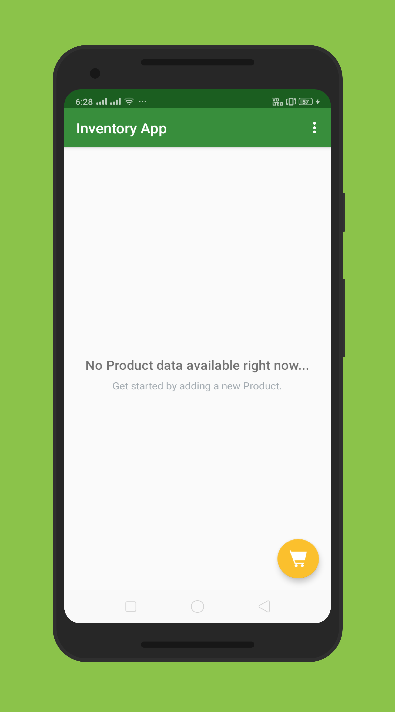
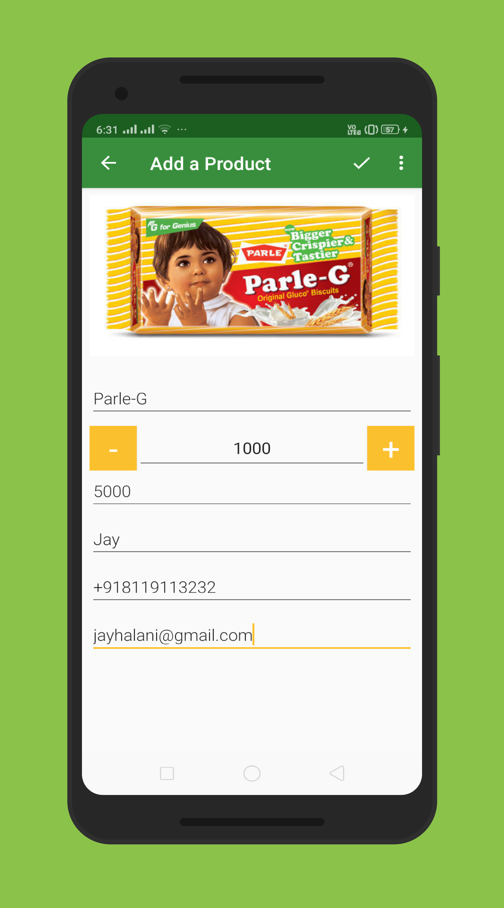
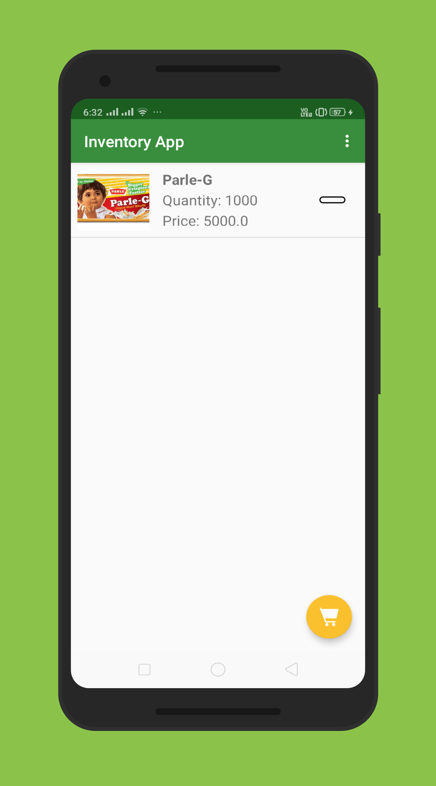
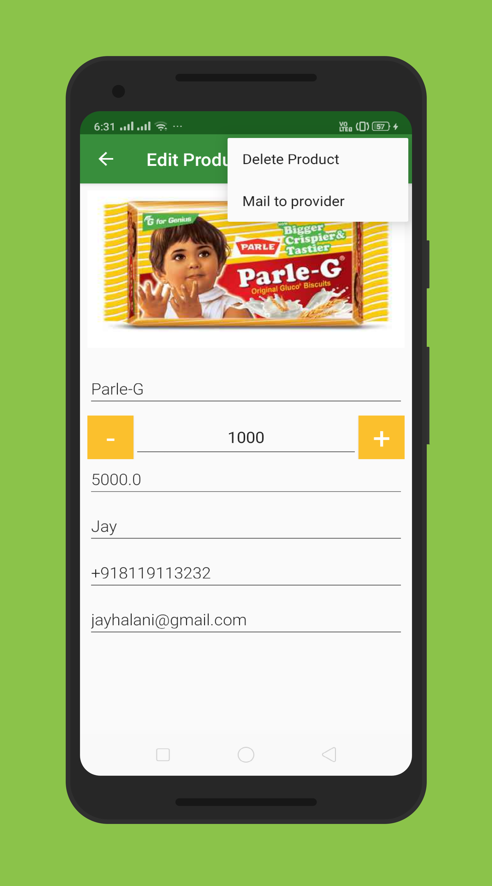

# InventoryApp
The goal is to design and create the structure of an Inventory App which would allow a store to keep track of its inventory of products. The app will need to store information about price, quantity available, supplier, and a picture of the product. It will also need to allow the user to track sales and shipments and make it easy for the user to order more from the listed supplier.

#### What I've learned from this project?
This project is about combining various ideas and skills I’ve been practicing throughout the course. They include:

* Storing information in a SQLite database
* Integrating Android’s file storage systems into that database
* Presenting information from files and SQLite databases to users
* Updating information based on user input.
* Creating intents to other apps using stored information.

## Screenshots

